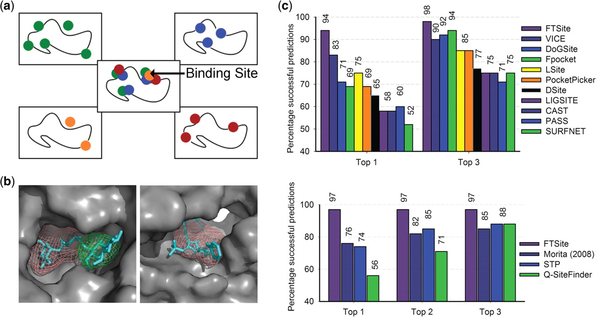

===========================
Background and Related Work
===========================

Structural hallmarks of peptide-protein interactions
------------------------------------------------------

.. hint::
    What are PePIs, and why are they interesting to study?

Protein-protein interactions are involved in numerous cellular
processes, from *something* to *something else*.

Often, these interactions are mediated by short, linear segments in
one partner, which assumes a defined structure only upon binding.
Since the rest of the protein doesn't contribute much to binding
energy, these interactions are considered peptide-protein
interactions, where the peptide is the crucial segment. Multiple
studies have shown that these segments retain their capacity to
interact with the receptor even when detached from the original
protein context.

There are also other kinds of peptide-protein interactions, in which
the peptide is a free oligopeptide, e.g. MHC proteins
interact with cleaved antigen fragments and display them onto the
cell surface.

**[Therapeutic peptides: relevant?]**

Hot spot residues in PPIs
~~~~~~~~~~~~~~~~~~~~~~~~~~

.. hint::
    The two definitions of hot spot residues (energetic, MSCS).
    How they coincide in PPIs.
    Difference between the two definitions, and the usefulness in
    different contexts. (see Zerbe et al. 2012)

Structural characterization of PePIs
~~~~~~~~~~~~~~~~~~~~~~~~~~~~~~~~~~~~~~~~~~

.. note::
    What do we already know about how PePIs behave?
    How are they different from other interactions?
    Reader should know about the results of PeptiDB study, especially
    about what hot spot residues are and the role they play.

London et al. [London2010]_ have conducted a structural analysis of
peptide-protein interactions. In that study, a set of 103 interactions
was collected, annotated and analyzed using various computational
methods. The analysis suggests that peptide-protein interactions are:

* mediated by *hot-spot residues* in the peptide, enriched in
  hydrophobic residues.
* receptor doesn't undergo major conformational change
* hydrogen bonds are enriched in interface, contributing a lot to
  binding energy.

**ORA: add more detail about peptidb study.**

.. commented

    Subsets of peptide-protein interactions
    """""""""""""""""""""""""""""""""""""""

    In order to provide a more close-up view of this kind of interactions,
    we looked closely at the defining characteristics of interaction
    subtypes, defined by the peptide structure. Already in [London2012]_
    it was apparent that helical peptides bind differently than beta
    peptides, which in turn differ from coil peptides. We set out to
    explore these differences from the hot-spot angle.

    * linear peptides: **something?**
    * helical peptides: **anything?**

Preliminary SVM study 
-----------------------------

The findings in the peptidb paper pointed to the unique features of
peptide-protein interactions. 
These features are encoded in the receptor structure, like pockets,
hydrogen bonding side-chains, surface accessibility, minimal
conformational change.

Support vector machines as a classification model
~~~~~~~~~~~~~~~~~~~~~~~~~~~~~~~~~~~~~~~~~~~~~~~~~

Definitions of residue features
~~~~~~~~~~~~~~~~~~~~~~~~~~~~~~~~

In a follow up study, we looked into the feasibility of designing a
Support Vector Machine as a predictor of peptide binding sites. We
looked at three qualitatively-different descriptors of a receptor
residue as features:

1. **Surface geometry**: we analyzed the receptor structure with
   CASTp [castp2009]_, which calculates
   pockets near the receptor surface. We then scored each residue
   based on its nearest pocket (size of pocket, proximity to pocket).
2. **Sequence conservation**: we used the ConSurf database [consurf]_
   to acquire conservation scores for each residue in the receptor.
3. **Computational fragment mapping**: we used the FTMap protocol
   [ftmap]_ to simulate fragment binding to the receptor surface. 

Computational solvent mapping
------------------------------

MSCS
~~~~~

Multiple Solvent Crystal Structures (abbreviated MSCS) is a prominent
experimental method to locate and characterize ligand binding sites on
protein surfaces [Mattos1996]_ [Allen1996]_.
In this method, the X-ray crystal structure of the protein of interest
is solved in aqueous solutions of several organic solvents separately.
These solvent molecules adhere to certain sites on the protein
surface, serving as probes.
They usually cluster together in a few binding sites.
Superimposing multiple structures of the protein in different solvents
reveals the power of this method.
It is common to see overlapping clusters of different solvent types in
a binding site, referred to as *consensus sites* (CSs).
These consensus sites delineate functionally important sites.

.. hint::
    impact of this method

This approach has proven very valuable in drug design. **[add more from
Mattos/Ringe]**

.. hint::
    lead into computational approach.

FTMAP
~~~~~~~

To avoid the laborious and costly experiments entailed by MSCS,
the FTMAP protocol was developed as a computational approximation.
FTMAP uses the Fast Fourier Transform (FFT) correlation approach to
efficiently sample
the rigid-body conformation space of a protein + probe complex.
That allows for accurate identification of probe binding sites,
followed by a clustering and ranking scheme.

    
    **[caption for ftsite figure]**

For each probe type, FTMAP generates 2000 bound conformations,
minimizes them, clusters them and finally ranks the clusters based on a
free-energy function.
Subsequently, clusters from difference probes are superimposed and
further clustered using a greedy, distance-based algorithm, to produce
consensus clusters. These are ranked by size (the number of clusters
included in each CS).

.. hint::
    * FTMap reproduces experimental MSCS with good accuracy.
    * FTMap successfully identifies PPI hot spots.
    * FTMap allows for fast, large-scale analysis of protein surfaces
      from the hot-spot point of view.

Rosetta FlexPepDock
-------------------

Rosetta FlexPepDock [Raveh2010]_ was developed in our lab to refine peptide models
in a binding site into an accurate model, by efficiently sampling the
peptide conformation space and selecting favorable conformations.
Subsequently it was extended to fold the peptide in-place starting
from a random conformation near the binding site, effectively
simulating a peptide folding upon binding [fpdock_abinitio:2011]_. But how can we know where
the peptide binds at all?

