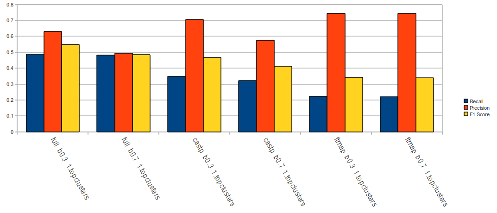
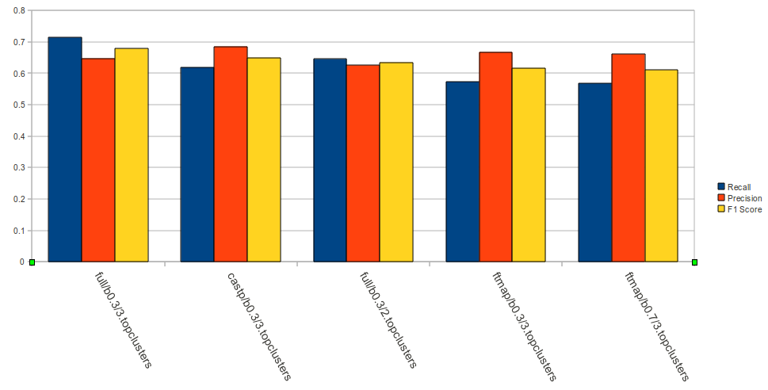
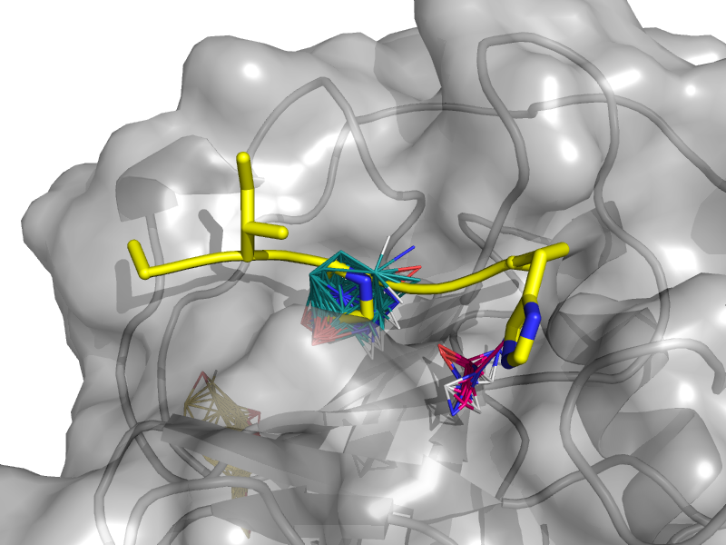
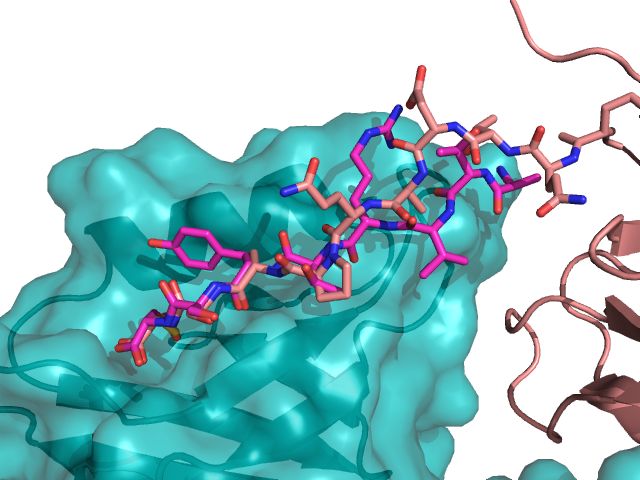
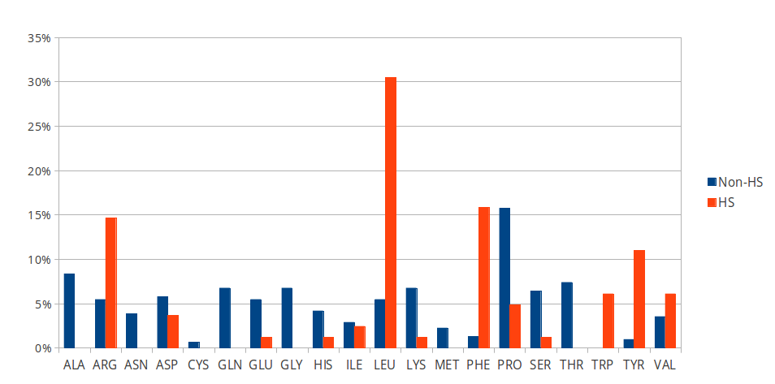

=======
Results
=======

.. note:: add outline paragraph (what do results include).

Prediction of interfaces using a machine-learning approach
--------------------------------------------------------------

In Methods, we described multiple protocols which can be
used to derive features that characterize the protein surface (FTMap,
CASTp, ConSurf, polarity, hbonding...).
We use a support vector machine to integrate these features into a
classifier that should identify the peptide-binding residues.
Output data from these protocols feed into our SVM model, such that
they inform the model about different characteristics of the residues
in question.

An underlying assumption in this part is that a peptide binding
site is defined by the surface residues in proximity to the peptide in
the complex structure.
Our goal is to identify these residues in the receptor structure
(whether bound or unbound), using these intrinsic properties, but
without any knowledge of the peptide or where it binds.

.. note: Move to methods:

    For each of the data sources, we formulated variables to capture the
    information these sources disclose about a given residue.
    These variables were used as columns in the training table for the SVM
    software, in addition to binary labels (binder/non-binder).
    Discrete variables were assigned consecutive integer values.
    All variables then underwent normalization (for details, see Methods
    section).

Given an input protein structure, the SVM classifier we designed
outputs a list of its surface residues (solvent accessibility obtained
from NAccess), each scored with the level of confidence that residue
is a binding residue.
In order to produce meaningful results out of such a list, we applied
an extra step of clustering these residues hierarchically.
That step produces a ranked set of residue clusters, each a
geometrically-dense collection of presumably-binding surface residues
as scored by the classifier.

For each input protein, we calculate precision and recall of the
classifier over a subset of output clusters. For instance, "top-3
recall" means the average of binding site recall rates, calculated
over the 3 top-ranked clusters.

.. note::

    * how are clusters ranked?

.. note:: define a classifier as SVM + clustering scheme

Performance of SVM is dependent on xyz, therefore we 
We examined multiple configurations of the SVM to optimized recall and
precision on training sets, obtaining performance data for each (see
figure comparing different classifiers we tried).
We experimented with different parameters of the SVM model, including:

* The SVM score cutoff above which a residue is labeled binding.
* The features on which the learning was based.
* Clustering parameters (see ``cluster_residues.py`` in ``peptalk``
  project).

-----------------------

    
    performance of different classifiers trained on PeptiDB, in terms
    of recall (blue), precision (orange) and F1-score (yellow).

    performance of the same classifiers, as measured over the top1
    clusters in each classifiers.

The data show that the classifiers which incorporate all data sources
(e.g. ``classifier1_full``) outperform those that specialize in one
aspect of the interaction (e.g. ``classifier3_ftmap``), in terms of
both recall and total F1 score.
However, none of the classifiers reached a satisfactory level of
accuracy.
Moreover, we found that classifiers based on computational fragment
mapping data alone (FTMAP) demonstrate markedly increased precision.
That precision is robust to bfactor filtering.

In other words, when a receptor residue is in proximity to an
important CS (large, highly scored), it stands a high chance of being
a binding residue. 

Visual inspection of several predictions showed that in many cases
where that classifier failed to find a hit within the top 3 results,
FTMap did find at least one of the hot-spot binding sites, but ranked
it too low for the classifier to detect the signal.

**In other words, there was a disparity between the quality of
predictions generated by the classifier, and the quality of the raw
data provided by FTMap.**
It has been well-shown that FTMap excels at detecting *hot-spot*
binding sites, representing them as consensus clusters docked on the
protein surface.
In this experiment, we were looking for the whole interface core, not
just the hot spots. That approach, as we realized, was adding noise to
a clear signal we got from FTMap.

    The interface between Cyclophilin A and the HAGPIA peptide from HIV1
    capsid protein. The top-ranked FTMap consensus site overlaps PRO4.

The interface core is comprised of residues with different chemical
groups performing different roles in the interaction. 
Some are involved in hot spot binding, making highly-favorable,
usually hydrophobic interactions with hot-spot residues on the peptide
side (let's call them *socket residues*).
Others are involved in hydrogen bonding, while other still provide
specificity by repelling certain residues in peptides that should not
bind that site.
It stands to reason that each of these types emits a different signal
in terms of our data sources, making the task of detecting all of them
more difficult. 
This led us to shift the focus of our study; rather than
characterizing the whole binding interface, we decided to focus on
hot-spot residues and their immediate binding pocket.

**The pockets wher hot spots bind are affected by multiple residues at a
time. This signal might not be evident in any individual residue, but
rather as a compound chemical effect at that site.**

This shift also eliminates the additional complexity of translating a
signal in the peptide space (hit CSs usually overlap with peptide
side-chains) to one in the receptor space (surface residues in
proximity to a CS).

Of all the features we examined, the most informative was by-far
FTMap's cluster score. It had a high correlation to residues actually
being binding residues. However, a SVM over receptor residues seemed
to blur the signal from this descriptor. This observation led us to
change our approach to the problem: rather than score residues in the
receptor, based on their proximity to probes in space, we elected to
identify those areas in space directly, and fit the peptide onto them

Contrary to the case with PPIs, peptides naturally don't expose a
large interaction surface. They instead depend on a few amino-acid
residues who contribute most of the binding energy.

Upon visual inspection of the results (especially failures), we
noticed problems in our data set, driving us to revise it with
updated, higher-quality structures and structural context.

.. note:: 
    
    insert examples of problematic structures in peptidb 1 in
    terms of binding site prediction (low resolution, NMR structures,
    low seqid).

PeptiDB2: a high-quality set of peptide-protein interaction data
----------------------------------------------------------------

We compiled a set of peptide-protein interactions, including
experimental structures of the bound complex and the unbound receptor. 
Curation started with the non-redundant set of 61 complexes described
in [peptidb:2010]_, each interaction undergoing manual inspection.
.. Several complexes from that set were manually refreshed when possible, or otherwise discarded.
If an interaction had any of the following "symptoms", it was either
fixed by replacing the structures representing it, or discarded:

* Unbound structure is NMR *[1d4t, 1jd5, 2zjd, 2oei, 3d9t]*. In most
  cases an X-ray structure was found as a substitute.
* Low sequence id between bound/unbound *[2p0w, 1se0, 2d0n, 1qkz,
  1jwg, 1hc9, 1ymt, 1t4f, 1ywo, 3cvp, 3d9t, 1dkz, 1tw6, 2jam]*. All
  interactions currently have **at least 91%** sequence identity between bound
  and unbound structures.
* Low-resolution unbound structure *[2v8y, 1fm9, 2j6f, 1nvr, 2p54]*.
  All structures in the data set are currently X-ray structures with
  :math:`<3.0 \AA` resolution.
* Better bound structure *[1sfi/2age, 2ak5/2df6, ]*
* Ambiguity over the identity of the peptide

Additionally, each entry was annotated with:

* Biological context and function of protein
* Biological unit and role of receptor in it (stable complex with
  other proteins, homo-oligomer)
* multiple peptides *[2vj0, 1lvm]*
* Crystal contact, especially in the interface *[1tp5]*
.. * domain decomposition of unbound (is relevant?)

For each of the interactions in the data set, the bound complex was
superimposed over the unbound receptor based on BLAST [BLAST]_
sequence alignment between the corresponding receptor chains.
Each of the receptors was additionally decomposed into individual
domains based on CATH classification [CATH]_, to allow per-domain
analysis of the peptide binding site.

Curation resulted in **[NUMBER OF LINES IN TABLE 1]** high-quality
interactions (see Table 1).

.. note::

    describe different features of peptidb2 (resolution, xray), and
    the purpose they serve in context of either past failures or
    future goals.

.. Structures are available as bound-unbound pairs, where the bound
.. complex is superimposed onto the unbound receptor. 

During curation of the PeptiDB2 data set, each of the interactions was
manually inspected. We noticed several trends in the structural data
that are interesting, and may underlie inconsistencies or shortcomings
of automated binding site prediction methods.

The implications of crystal contacts at the binding site
~~~~~~~~~~~~~~~~~~~~~~~~~~~~~~~~~~~~~~~~~~~~~~~~~~~~~~~~~

One of the standard methods we applied to investigate crystal contacts
in a PePI was to compare symmetry mates of the unbound structure
(within 5A) with the peptide itself.

Several interactions exhibited symmetry mates of the free receptor
crystal structure closely overlapping with the peptide in the complex
structure.

    1N7E crystal contact, with high overlap with the peptide.

In other interactions, we noticed symmetry mates of the bound
receptor possibly stabilizing the peptide in the interface.

.. note:: address differences between bound/unbound crystal contacts.

.. raw:: latex
    \usepackage{lscape}
    \begin{landscape}

.. csv-table:: 
    :file: _tables/peptidb2_table1.csv
    :header-rows: 1

.. raw:: latex
    \end{landscape}

Characterization of hot spot residues in PeptiDB2
~~~~~~~~~~~~~~~~~~~~~~~~~~~~~~~~~~~~~~~~~~~~~~~~~~

    Amino-acid distribution in hot-spot residues among peptide
    residues in PeptiDB2, versus that in non-hot-spot residues in the
    same data set.

PeptiDB2 summary table
~~~~~~~~~~~~~~~~~~~~~~~

.. csv-table::
    :url: https://docs.google.com/spreadsheet/pub?key=0ApXQ1x_sHoGrdFYwdEJ6aTFZckc3cHlzZEVzV01jUWc&single=true&gid=2&range=A1%3AF100&output=csv
    :header-rows: 1
    :widths: 2 1 1 2 1 2

Crystal contacts in PePIs
~~~~~~~~~~~~~~~~~~~~~~~~~~~~~~~~~~~~~~~~~~~~~

In several of the structures curated, we noticed symmetry mates of the
unbound receptor visibly overlapping with the peptide. 

..
    Comparing the sequences of these tails to their corresponding peptides
    did not reveal high sequence correlation **[STATISTICS HERE]**.

This usually involves an extended terminus in the unbound receptor. We
have yet to investigate the meaning of this phenomenon.

Machine-learning analysis of binding site features
~~~~~~~~~~~~~~~~~~~~~~~~~~~~~~~~~~~~~~~~~~~~~~~~~~

details about SVM analysis here.

Features:

1. Short peptides (5-15 aa)
2. Non-redundant (seqid < 70%)
3. 44 interactions, represented by high-quality X-ray structures (bound + unbound) with resolution < 2.5Å

Other data sets: PeptiDB1 (n=103), PepX (n=505)

Preliminary machine-learning analysis of receptor surface residues suggested hot-spots as a reliable indicator of proximity to binding site.

PeptiMap: an accurate tool for identifying hot-spot binding sites
[b]

FT-Map2 performs a global search of the entire protein surface for regions that bind a number of small organic probe molecules. Probes are clustered together to form consensus sites (CS), which represent potential binding sites.

The search is based on the very efficient fast Fourier transform (FFT) correlation approach which can sample billions of probe positions, and on a detailed energy expression, resulting in a very accurate identification of low-energy probe clusters.

Hot-spots are key to understanding peptide-protein interactions
----------------------------------------------------------------

The crucial role that hot spot residues play in protein-protein and
peptide-protein interactions is a matter of consensus
[ftmap_analysis]. 

PeptiMap: an accurate predictor of peptide binding sites
---------------------------------------------------------

Motivation
~~~~~~~~~~~

Taken from conclusions of PeptiDB analysis of hot spots
Justification of hot spot approach to binding site detection.

Computational fragment mapping is a reliable approximation of hot-spot analysis
~~~~~~~~~~~~~~~~~~~~~~~~~~~~~~~~~~~~~~~~~~~~~~~~~~~~~~~~~~~~~~~~~~~~~~~~~~~~~~~~~~

Rationale of fragment mapping approach
~~~~~~~~~~~~~~~~~~~~~~~~~~~~~~~~~~~~~~

Track record of FT-Map in other contexts
~~~~~~~~~~~~~~~~~~~~~~~~~~~~~~~~~~~~~~~~~

Method: what is different about PeptiMap

PeptiMap successfully predicts binding sites
~~~~~~~~~~~~~~~~~~~~~~~~~~~~~~~~~~~~~~~~~~~~

Against the competition

Low-resolution modeling of PPIs from PeptiMap predictions
~~~~~~~~~~~~~~~~~~~~~~~~~~~~~~~~~~~~~~~~~~~~~~~~~~~~~~~~~

some results here

Predicting peptide binding sites 
--------------------------------

In order to evaluate how reliable PeptiMap identifies peptide binding
sites on protein structure, we tested it over a set of unbound
receptors taken from the PeptiDB v2 data set.

[Move to methods] When queried with a receptor structure, PeptiMap
performs the FFT analysis and outputs a ranked list of consensus
sites, each represented by atoms of the respective probes. We consider
a result (predicted binding site) successful when its centroid is
within 4 angstroms of any peptide atom - a criterion we borrow from
the LigSite method. [Methods: assessment of
prediction quality]

Out of the 48 structures [with status either 1 or 2] in the PeptiDB
data set, 29 were evaluated by PeptiMap [why just 29?]. Initial
analysis failed on 4 structures, i.e. did not produce any result. They
were later re-analyzed using either better domain division or masking
previously-detected areas on the surface.

After re-analyzing "difficult" [red] structures, 60% of the peptide
binding sites were correctly indicated by the top result, and 97% by
one of the top three results.

Since the algorithm is based on the geometric properties of the
protein, inter-domain crevices are known to bias the search. Therefore
in multi-domain proteins we analyze each domain separately, and the
receptor at large as well. 

[Compare with pepsite]

We tested PeptiMap on PeptiDB2, and compared it to PepSite
[Petsalaki2009]_, a program for peptide binding site prediction, that searches for structural environments that are similar to ones observed in known complex structures, on a residue basis.

In this initial assessment, we used the interactions with identical sequence in the bound and unbound receptor. This eliminates artifacts that may result from sequence changes in the binding site.

Overall performance of PeptiMap
-------------------------------

PeptiMap accuracy is increased when the search is performed on distinct domains, and interfaces between domains and between other binding partners are masked (“PeptiMap dom”, red bars). This allows to focus the search on relevant regions.

Success criterion: center of predicted site is within 4Å of any peptide heavy atom. Performance of PepSite2 is shown for comparison.

Example of PeptiMap prediction for the unbound human TRAF domain, overlaid with the peptide from a complex structure of TRAF with PQQADD from CD40 (PDB IDs 1CA4, 1CZY); the peptide overlaps with sites ranked 1 (magenta), 2 (yellow) and 5 (blue).

