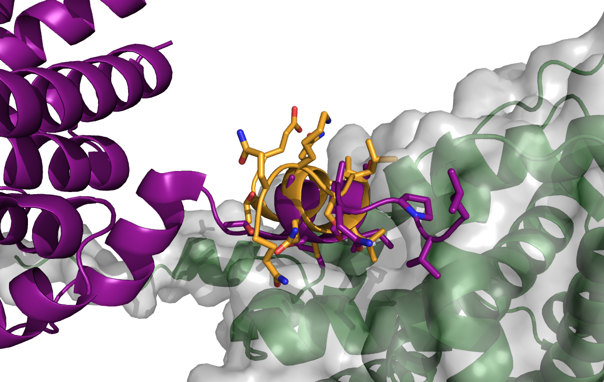
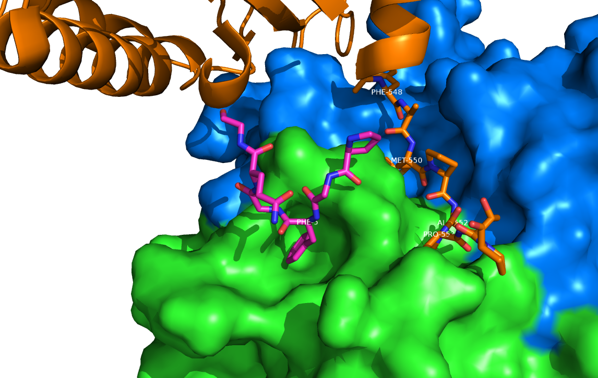
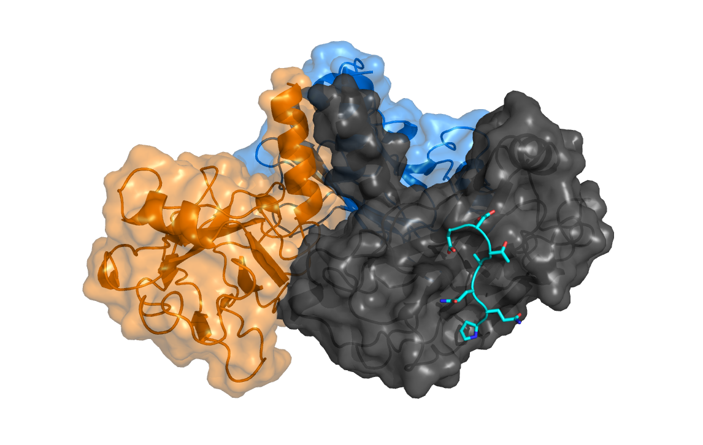

=======
Results
=======

Recapitulating previous work by London et al., peptide-protein
interactions are characterized by several features. 
The previous study found that peptides usually bind within a large pocket in the
receptor, and form a network of hydrogen bonds with the interface
residues on the receptor side.
It was also noted that hot spot residues are responsible for the lion's
share of interaction energy, using mostly non-polar interactions. 

Indeed, these features characterize peptide-protein interactions, but
do they *determine* the peptide binding site?
If so, which features are most important?
Can we accurately predict a peptide binding site based on this
analysis?

In this section we show that these receptor-intrinsic properties
indeed guide the interaction to a measureable extent, particularly the
sites that can potentially interact with hot-spot residues.
We present a data set of peptide-protein interactions, curated to
reliably reflect these interfaces.
Finally we evaluate our capacity to predict hot-spot interactions
in peptide-protein interactions using computational fragment mapping.

.. warning::

    ORA: improve here the flow - between each sentence make a connection so the reader gets why you did this. You can write something about residues-based vs site based, and about the strong signal you got for FTmap

Support-vector classification of surface residues
--------------------------------------------------------------

We draft a strategy for detecting a peptide binding sites, under the
assumption that it is determined by the hallmark chemistry detailed
above. [**like a chemical fingerprint of PePIs**]

By defining a peptide binding site by the receptor residues in
proximity to the peptide in the bound complex, one would 
be able to locate it by identifying surface residues that have high
capacity to take part in these interactions.

.. comment
    These residues can be characterized by their capacity to take part in the chemical processes described above.
    An underlying assumption in this part is that a peptide binding
    site is defined by the surface residues in proximity to the peptide in
    the complex structure.

.. comment
    We assemble a profile for each surface residue, quantifying its
    capacity to take part in different hallmark characteristics.
    We use several protocols to analyze the receptor structure.
    This analysis is used to derive features 
    We quantify a residue's probability of by deriving
    residues by their capacity to 

Structural features indicate the binding site
~~~~~~~~~~~~~~~~~~~~~~~~~~~~~~~~~~~~~~~~~~~~~~

In Methods, we described multiple protocols which can be used to
derive features that characterize the protein surface (namely FTMap,
CASTp, ConSurf, polarity, hbonding).
While these protocols analyze the entire receptor, we derive features
that describe individual residues.

These features are integrated into a
support-vector classifier (see :ref:`methods-svm`) that should
identify the peptide-binding residues.

.. comment
    Output data from these protocols feed into our SVM model, such
    that they inform the model about different characteristics of the
    residues in question.

Features include:

- FragmentNormalizedRank, FragmentSize
- PocketSize
- ConservationScore
- AA polarity and hbonding

.. warning::

    [ORA: define these features (at least in methods - and then write a short sentence to remind the reader here what these names mean). Polarity and hbonding probably means that you look at whether the amino acid can be a donor or acceptor, right? This information helps the reader understand. In short, read this with the eyes of a layman and see if you would understand...]

Our goal is to identify these residues in the receptor structure
(whether bound or unbound), using these intrinsic properties, but
without any knowledge of the peptide or where it binds.
As a starting point, we trained our model on surface residues from the
set of bound receptor structures.

.. warning::

    [ORA: improve figure- larger font and remove the comment to Dana. Also, I think that the important part is here what is input: FTMap, CastP,etc and the output of each of these  should be in a similar format as Naccess and SASA, and polarity... THe scheme can be much simpler and does not need the post-processing square (this can be mentioned in the text/methods and is not important). 
You can indeed put it to the methods as you write below in Notes. In that case, just improve the flow so here it sounds right without the scheme.]

    Schematic description of data flow in our classification model.

We performed 3-fold stratified cross-validation (CV) of our classification
model over the set of surface residues of bound receptor structures. 
Each iteration involved training a classifier using two folds, and
testing it on the third one.

.. warning::

    [ORA: change the word "folds": this is confusing as it could also mean structural fold. You can write: using 2/3 of the data set and testing on the remaining 1/3.]

The classifier's performance is measured by the area under the ROC
curve associated with it.

.. warning::

    [ORA: define ROC in the Methods section, or here....]

    ROC curves of SVM classifiers during 3-fold cross-validation.

The model achieves a mean AUC of :math:`0.81`, with very little
variance between CV instances. This supports our hypothesis that the
features we selected indeed carry a measurable signal disclosing the
interface residues on a protein surface.

.. warning::

    ORA: here give the weights of the different features in the different models: are they always similar, and what do they mean. e.g. show that the FTmap input provides a strong signal by itself.
    
    You or/and Dana did feature elimination - here is the place to put the results: you reached the conclusion that these are the important parameters and others are not somehow, and this should be mentioned here ...

Clustering highly-ranked residues is useful
~~~~~~~~~~~~~~~~~~~~~~~~~~~~~~~~~~~~~~~~~~~~~

Given an input protein structure, the SVM classifier we designed
outputs a list of its surface residues, each scored with a probability of being a binding residue.

In order to produce meaningful results out of such a list, we applied
an extra step of clustering these residues hierarchically.
That step produces a ranked set of residue clusters, each a
geometrically-dense collection of presumably-binding surface residues
as scored by the classifier.

For each input protein, we calculate precision and recall of the
classifier over a subset of output clusters. For instance, "top-3
recall" means the average of binding site recall rates, calculated
over the 3 top-ranked clusters.
Clusters are ranked by spatial clustering degree, aiming for
tightly-knit groups of positive predictions to be ranked high.

.. warning::

    [ORA: The paragraph above belongs to methods (you can judge when you write a very technical description that it probably needs to be moved). Here you should rather provide the results: show a figure that exemplifies an output, and how clustering in space helps focusing on dense clusters.]

This pipeline essentially constitutes a prediction protocol, which
upon an input protein structure generates a ranked list of residue
clusters as predicted binding sites.

Performance of SVM is dependent on xyz, therefore we 
We examined multiple configurations of the SVM to optimized recall and
precision on training sets, obtaining performance data for each (see
figure comparing different classifiers we tried).

.. warning::

    [ORA: The transition between the per residue and per site assessment is a little difficult to follow: you should present the data in a similar format. So in addition to the ROC above, you could provide a similar plot to Figure 4.3., and compare it to 4.4.? It is still not clear why you needed clustering from your text, and how you compare, and define, "performance" in both contexts. (I can of course retrace it after I read the full text, but this should be clear to a layman during his reading, not only at the end...).]

We experimented with different parameters of the SVM model, including:

* The SVM score cutoff above which a residue is labeled binding.
* The features on which the learning was based.
* Clustering parameters (see ``cluster_residues.py`` in ``peptalk``
  project).

.. warning::

    Figure xx shows the performance using different combinations. 
    
    [ORA: you need to provide a legend of the different combinations, and connect this to the list above. I suggest that instead of the path as x-axis label, you A,B.... and then you specifiy what A,B... represent, in words].

.. figure:: _images/top1_classifiers.png
    :align: center
    :width: 100%
    
    performance of different classifiers trained on PeptiDB, in terms
    of recall (blue), precision (orange) and F1-score (yellow).

    performance of the same classifiers, as measured over the top1
    clusters in each classifiers.

Insights from the SVM model
~~~~~~~~~~~~~~~~~~~~~~~~~~~~~~

The data show that the classifiers which incorporate all data sources
(e.g. ``classifier1_full``) outperform those that specialize in one
aspect of the interaction (e.g. ``classifier3_ftmap``), in terms of
both recall and total F1 score.

.. warning::

    [ORA: you start here with a very small set of parameters and omitted other parameters here: what about "polar" and others that Dana analyzed? You should mention that these are not enough, or redundant.... Or did you look at this only at the residue level? you should then mention this too..]

However, none of the classifiers reached a satisfactory level of
accuracy.

.. warning::

    [ORA: You should explain why before you got 0.8 AUC on per residue basis and here the values are lower. It is not clear why then you moved to site rather than residue prediction.....]

Moreover, we found that classifiers based on computational fragment
mapping data alone (FTMAP) demonstrate markedly increased precision.
That precision is robust to bfactor filtering.

.. warning::

    [ORA: define in methods what bfactor filtering is, and here define why you test this at all...]

In other words, when a receptor residue is in proximity to an
important CS (large, highly scored), it stands a high chance of being
a binding residue. 

Visual inspection of several predictions showed that in many cases
where that classifier failed to find a hit within the top 3 results,
FTMap did find at least one of the hot-spot binding sites, but ranked
it too low for the classifier to detect the signal.

.. warning::

    [ORA: Figure 4.5. should come here and be referred to].

**In other words, there was a disparity between the quality of
predictions generated by the classifier, and the quality of the raw
data provided by FTMap.**

.. warning::

    [ORA: So maybe we should redefine the criterion and look for defined hotspots only...]

It has been well-shown that FTMap excels at detecting *hot-spot*
binding sites, representing them as consensus clusters docked on the
protein surface.
In this experiment, we were looking for the whole interface core, not
just the hot spots. That approach, as we realized, was adding noise to
a clear signal we got from FTMap.

.. figure:: _images/1awr_ftmap_ppdb.png
    :width: 60%
    :align: center

    The interface between Cyclophilin A and the HAGPIA peptide from HIV1
    capsid protein. The top-ranked FTMap consensus site overlaps PRO4.

.. warning::

    [ORA: stopped here]

The interface core is comprised of residues with different chemical
groups performing different roles in the interaction. 
Some are involved in hot spot binding, making highly-favorable,
usually hydrophobic interactions with hot-spot residues on the peptide
side (let's call them *socket residues*).
Others are involved in hydrogen bonding, while other still provide
specificity by repelling certain residues in peptides that should not
bind that site.
It stands to reason that each of these types emits a different signal
in terms of our data sources, making the task of detecting all of them
more difficult. 
This led us to shift the focus of our study; rather than
characterizing the whole binding interface, we decided to focus on
hot-spot residues and their immediate binding pocket.

**The pockets wher hot spots bind are affected by multiple residues at a
time. This signal might not be evident in any individual residue, but
rather as a compound chemical effect at that site.**

This shift also eliminates the additional complexity of translating a
signal in the peptide space (hit CSs usually overlap with peptide
side-chains) to one in the receptor space (surface residues in
proximity to a CS).

London et al. [peptidb]_ reported an interesting pattern in the
geometries of the interfaces they studied. Peptides bind either in
a large pocket on the receptor surface, or in a knobs-in-holes manner,
i.e. where the interface is composed of a group of small sites each
binding one chemical group in the peptide.

.. note:: requires support in data and rephrasing

    Overall, it is evident in the data that FTMap is more sensitive to
    knobs-in-holes interfaces, while still maintaining comparable
    performance in big pocket interfaces.

Of all the features we examined, the most informative was by-far
FTMap's cluster score. It had a high correlation to residues actually
being binding residues. However, a SVM over receptor residues seemed
to blur the signal from this descriptor. This observation led us to
change our approach to the problem: rather than score residues in the
receptor, based on their proximity to probes in space, we elected to
identify those areas in space directly, and fit the peptide onto them

Contrary to the case with PPIs, peptides naturally don't expose a
large interaction surface. They instead depend on a few amino-acid
residues who contribute most of the binding energy.

Upon visual inspection of the results (especially failures), we
noticed problems in our data set, driving us to revise it with
updated, higher-quality structures and structural context.

.. note:: 
    
    insert examples of problematic structures in peptidb 1 in
    terms of binding site prediction (low resolution, NMR structures,
    low seqid).

PeptiDB2: a high-quality set of peptide-protein interaction data
----------------------------------------------------------------

- In light of what described above, we revised our data set
  in an effort to eliminate experimental artifacts and increase
  overall quality of structures.

We compiled a set of peptide-protein interactions, including
experimental structures of the bound complex and the unbound receptor. 

Curation started with the non-redundant set of 61 complexes described
in [peptidb:2010]_, each interaction undergoing manual inspection.

..  curation details:
    
    Several complexes from that set were manually refreshed when possible, or otherwise discarded.
    If an interaction had any of the following "symptoms", it was either
    fixed by replacing the structures representing it, or discarded:
    * Unbound structure is NMR *[1d4t, 1jd5, 2zjd, 2oei, 3d9t]*. In most
      cases an X-ray structure was found as a substitute.
    * Low sequence id between bound/unbound *[2p0w, 1se0, 2d0n, 1qkz,
      1jwg, 1hc9, 1ymt, 1t4f, 1ywo, 3cvp, 3d9t, 1dkz, 1tw6, 2jam]*. All
      interactions currently have **at least 91%** sequence identity between bound
      and unbound structures.
    * Low-resolution unbound structure *[2v8y, 1fm9, 2j6f, 1nvr, 2p54]*.
      All structures in the data set are currently X-ray structures with
      :math:`<3.0 \AA` resolution.
    * Better bound structure *[1sfi/2age, 2ak5/2df6, ]*

In order to isolate the effect of conformational change in the
receptor, we require high sequence identity between bound and unbound
receptor structures (:math:`>90 \%`). In 12 interactions in our original data set where
sequence identity was low, no substitute was found to the original
unbound structure, and they were cut out of the clean data set.

For the same reason, we require that unbound structures be
precise X-ray structure (resolution :math:`<3.0 \text{Å}`).
Overall, 13 interactions were discarded due to low quality of the
unbound structure, and 9 were updated with more suitable structures.
Additionally, two interactions were updated with new bound structures,
bringing the total count of samples to 48 interactions (see details in
:ref:`table-peptidb`).

Each entry was manually examined and annotated with information
regarding its biological context and assembly, crystal contacts,
hot spot residues.

* Biological context and function of protein
* Biological unit and role of receptor in it (stable complex with
  other proteins, homo-oligomer)
* multiple peptides *[2vj0, 1lvm]*
* Crystal contact, especially in the interface *[1tp5]*
.. * domain decomposition of unbound (is relevant?)

For each of the interactions in the data set, the bound complex was
superimposed over the unbound receptor based on BLAST [BLAST]_
sequence alignment between the corresponding receptor chains.
Each of the receptors was additionally decomposed into individual
domains based on CATH classification [CATH]_, to allow per-domain
analysis of the peptide binding site.

.. note::

    describe different features of peptidb2 (resolution, xray), and
    the purpose they serve in context of either past failures or
    future goals.

.. Structures are available as bound-unbound pairs, where the bound
.. complex is superimposed onto the unbound receptor. 

During curation of the PeptiDB2 data set, each of the interactions was
manually inspected. We noticed several trends in the structural data
that are interesting, and may underlie inconsistencies or shortcomings
of automated binding site prediction methods.

The implications of crystal contacts at the binding site
~~~~~~~~~~~~~~~~~~~~~~~~~~~~~~~~~~~~~~~~~~~~~~~~~~~~~~~~~

.. note:: Crystal Contacts in X-ray structures

    The most prominent method for solving protein structures is X-ray
    crystallography. To apply it, a crystal is made from a highly
    concentrated solution of the protein. In the crystal, individual
    protein molecules are arranged in a lattice. The crystal is then
    blasted with an X-ray beam, and an electron-density
    map is obtained from the resulting diffraction pattern.
    
    Due to the high concentration in the solution, sometimes proteins
    in the crystal bind each other. These interactions, which are
    suspected artifacts of the experiment, are called
    *crystal contacts*.
    They can, however, reveal surprising mechanisms of strutural
    regulation.

    Molecular visualization programs are able to reproduce the arrangement
    of proteins in the crystal by generating additional copies and
    transforming them using translation and rotation matrices documented
    in the experiment data. 
    These additional copies are called *symmetry mates*, and within small
    distances from the protein, they illustrate the immediate environment
    of the protein in the crystal.

.. commented
    One of the standard methods we applied to investigate crystal contacts
    in a PePI was to compare symmetry mates of the unbound structure
    (within 5A) with the peptide itself.

Several interactions exhibited symmetry mates of the free receptor
crystal structure closely overlapping with the peptide in the complex
structure.

.. _fig-cryst-contacts-unbound-pdz:

    The crystal structure of the PDZ6 domain of GRIP1, as solved in an
    *unbound* context, interacting with the C-terminal tail of one of
    its neighbor proteins in the crystal (grey cartoon, sequence
    TDAQPASS). 
    The peptide that binds PDZ6, an 8-mer derived from liprin alpha,
    is superpositioned in its native binding site (PDBID 1N7F,
    sequence ATVRTYSC).
    Note the high overlap between the native peptide and the C
    terminus, manifested in a 2.43A RMSd calculated over backbone
    atoms of the two fragments (2.06A over the last 7 residues).

:num:`Figure #fig-cryst-contacts-unbound-pdz` illustrates one
interesting instance of crystal contacts in the unbound crystal
structure.
A symmetry mate of the unbound receptor clearly interacts with the
binding site of the peptide.

The paper describing the experiment addresses this issue, suggesting a
dual mechanism of dimerization of PDZ6 [**citation here**].
In its free form, PDZ6 is able to form an antiparallel dimer using its
C-terminus to bind the binding pocket of its partner. 
Upon binding the liprin alpha peptide, a parallel beta sheet can form
in en entirely different orientation.
http://www.jbc.org/content/278/10/8501.long

We observe a similar patter in the free structure of human
Mineralocorticoid receptor (mutated C808S, S810L) 
(:num:`Figure #fig-cryst-contacts-unbound-2aax`).
The N-terminal helix of chain B interacts with the binding pocket. 
Peptide is superpositioned in the binding site for comparison.
Biological unit is dimeric according to both PDB files, but the AB
dimer in the structure is "irrelevant biologically".
This crystal contact is assymetrical and does not support a homodimer.
It does, however, allow an oligomer to form via circular chaining of
certain symmetry mates. [**consult with Ora**]

.. _fig-cryst-contacts-unbound-2aax:

    Crystal structure of human Mineralocorticoid receptor in its
    unbound form (green surface representation), 
    with the N-terminal helix from one symmetry
    mate (03000100) displayed occupying the peptide binding site
    (purple).
    The QQKSLLQQLLTE peptide from Nuclear Receptor Coactivator 1 is
    superpositioned in its binding site (gold).

Since X-ray structures are the reference point of many structural
studies of proteins, determining whether crystal contacts are 

.. note:: Bound crystal contacts stabilizing peptide

    In other interactions, we noticed symmetry mates of the bound
    receptor possibly stabilizing the peptide in the interface.

.. _fig-cryst-p15tap-1jkg:

    Caption here

Another interesting interaciton is between the human TAP-p15
heterodimer and a FG-repeat peptide from nucleoporin (:num:`Figure
#fig-cryst-p15tap-1jkg`)
The peptide binds a hydrophobic pocket on TAP, with no direct
interaction with p15.
However, p15 is required for a stable interaction [**??**].

Upon generating symmetry mates for the heterodimer, it becomes clear
that it binds yet another peptide fragment.
The C-terminal tail of the crystallized TAP structure, part of a
linker to a subsequent UBA domain, binds the heterodimer in an
inter-domain groove between p15 and TAP, adjacent to the FG-peptide
binding site.

.. note::
    
    - in both structures there's a missing loop 423-429, located away
      from the interface.

    - TAP is made from two domains (NTF2-like and Ubiquitin-like),
      only the NTF2 domain is crystallized (UBA was disordered).
      The C-terminal tail is the linker between the domains.

    - To the best of our knowledge, there is no evidence that this
      interaction is biologically significant.
      In that case, it illustrates the difficulty in identifying these
      interactions.

Biological units
~~~~~~~~~~~~~~~~~~~~~~

.. note:: What is the message here?

    In some cases, crystal structures are mis-annotated with respect to
    biological unit.
    During the curation of PeptiDB2 this issue required manual inspection
    and cross-referencing of protein structures and annotations.

.. note:: requires support

    In fact, in a recent study, Dunbrack et al. *[citation here]*
    estimate 50% of all X-ray structures in the Protein Data Bank
    include incorrect biological assembly remarks.

In order to simplify analysis, curation of PeptiDB 1 included cleaning
raw PDB structures from inconsistent data.
One procedure applied as preprocessing was extracting the interacting
chain from the whole structure [**why? was it just convenience?**].
That was OK for analyzing the interactions.
However, to distinguish a
binding site from the rest of the protein it is best to be aware of
the actual surface exposed by the protein in its biological context.

.. _fig-trimer-1ca4:

    Caption for TRAF trimer figure.

For example, we've curated the crystal structure of the TRAF domain
trimer (PDBID 1ca4ABC) (:num:`Figure #fig-trimer-1ca4`).
In peptiDB 1 it is analyzed as a monomer
(chain A).
This makes any prediction protocol take into account residues that are
usually not even exposed to the solvent, and hence they are not
accessible to the peptide.

.. note:: SH2 misannotation (?) as tetramer

    The crystal structure of SAP SH2 domain (PDBID 1d1z) is a high
    resolution model of a common domain involved in many signalling
    pathways.
    The author-determined biological unit for this protein is a
    *tetramer*, while in another structure it is a dimer.

Characterization of hot spot residues in PeptiDB2
~~~~~~~~~~~~~~~~~~~~~~~~~~~~~~~~~~~~~~~~~~~~~~~~~~

.. figure:: _images/aa_histogram_peptidb2.png
    :width: 75%

    Amino-acid distribution in hot-spot residues among peptide
    residues in PeptiDB2, versus that in non-hot-spot residues in the
    same data set.

Toward accurate prediction of peptide binding sites
----------------------------------------------------------------

Are hot-spots enough to predict the entire binding site?
~~~~~~~~~~~~~~~~~~~~~~~~~~~~~~~~~~~~~~~~~~~~~~~~~~~~~~~~~

Once PeptiDB2 reached a suffienct measure of quality, we performed 
computational fragment mapping on the unbound set of receptors.
On the same input, we also ran PepSite2, an existing protocol for
peptide binding site identification (see details in
:ref:`Methods <methods-pepsite>`).

PepSite2 uses a completely different approach to represent and predict
the peptide interface. It is a probabilistic model calibrated
specifically for peptide interfaces, which makes use of PSSMs to
capture individual preferences of peptide residues to certain
environments. Unlike PeptiMap, prediction is highly dependent on the
peptide sequence, and requires a peptide sequence as input, 3-10 amino
acids long. In cases where peptidb2 contains peptides longer than 10 residues,
PepSite2 was provided with a 10aa sub-sequence of the peptide,
selected to minimize the average distance from any receptor atom.

For both prediction protocols, we consider two ways of defining a
correct prediction: *top-1 hit* and *top-3 hit*, meaning there is a
*hit* within the top 1 and top 3 sites respectively identified by the
protocol in question.
A predicted site is considered a *hit* when its center of mass is
within :math:`4 \text{A}` of any ligand atom, as defined by the LigSiteSC
criterion [ligsite]_. The ligand in this context is the peptide,
translated and rotated to its correct binding site.

As a first evaluation of out method, we tested it on a subset of
29 interactions from PeptiDB2, where the sequences of bound and
unbound receptor are completely identical (100% sequence identity).
The rationale was to eliminate conformational changes that stem from
sequence variation.

.. comment
    In Dima's spreadsheet describing this result, he counts 30
    interactions over which he performed analysis. That's because he
    considered *1b9k* twice, one with each different peptide (2vj0
    chains P and Q). These are indeed different interactions, but in
    my peptidb2 table, there is only one of them, with the P peptide.

.. note:: figure comparing performance of PepSite2 and FTMap

Again, visually reviewing the results implicated one possible cause
for multiple failed predictions: in receptors that included multiple
domains, FTMap performed much better when each of the domains was
analyzed separately.
That can result from many of the top-ranked probes being attracted to
the domain-domain interface.

    The alpha subunit of the endocytotic AP2 adaptor complex
    is composed of two distinct domains.
    Both domains interact with their respective partners via a
    peptide-domain interface, and both interactions were observed
    simultaniously in a crystal structure (PDB ID **2VJ0**). 
    Fragment mapping of the entire chain (containing both domains)
    completely misses, while mapping each domain separately finds at least
    one hit for each domain within the 3 top predicted sites, where
    domain-domain sites were masked, essentially blocking any CSs from
    forming there.

Among the 29 interactions analyzed, we found 5 such interactions where
fragment mapping did better on individual domains than on the whole
receptor.

Based on these observations, we tested FTSite against PepSite2 on all
interactions in peptidb2, and here are the results for top1 hits:

.. csv-table::
    :file: _tables/confusion_matrix_top1.csv
    :header-rows: 1
    :stub-columns: 1

and top 3 hits:

.. csv-table::
    :file: _tables/confusion_matrix_top3.csv
    :header-rows: 1
    :stub-columns: 1

**What conclusions can we draw from these data?**

We evaluate the effectiveness of domain decomposition by comparing hit
and miss numbers between the two approaches on the 38 interactions
that actually have CATH domains defined:

.. table::
    
    +-------------+-------------------+--------------------+
    | FULL_RESULT | DOMAIN_DECOMP_HIT | DOMAIN_DECOMP_MISS |
    +=============+===================+====================+
    | HIT         | 20                | 1                  |
    +-------------+-------------------+--------------------+
    | MISS        | 4                 | 13                 |
    +-------------+-------------------+--------------------+

.. note:: The numbers don't add up to 48 here
    
    That's because in 10 interactions there is no other domain except
    0.
    
----------------------------

Predicting peptide binding sites 
--------------------------------

In order to evaluate how reliable PeptiMap identifies peptide binding
sites on protein structure, we tested it over a set of unbound
receptors taken from the PeptiDB v2 data set.

.. comment
    When queried with a receptor structure, PeptiMap
    performs the FFT analysis and outputs a ranked list of consensus
    sites, each represented by atoms of the respective probes.
    We consider a result (predicted binding site) successful when its
    centroid is within 4 angstroms of any peptide atom - a criterion we
    borrow from the LigSite method. [Methods: assessment of prediction
    quality]

Out of the 48 structures [with status either 1 or 2] in the PeptiDB
data set, 29 were evaluated by PeptiMap [why just 29?]. Initial
analysis failed on 4 structures, i.e. did not produce any result. They
were later re-analyzed using either better domain division or masking
previously-detected areas on the surface.

After re-analyzing "difficult" [red] structures, 60% of the peptide
binding sites were correctly indicated by the top result, and 97% by
one of the top three results.

Since the algorithm is based on the geometric properties of the
protein, inter-domain crevices are known to bias the search. Therefore
in multi-domain proteins we analyze each domain separately, and the
receptor at large as well. 

We tested PeptiMap on PeptiDB2, and compared it to PepSite
[Petsalaki2009]_, a program for peptide binding site prediction, that
searches for structural environments that are similar to ones observed
in known complex structures, on a residue basis.

In this initial assessment, we used the interactions with identical
sequence in the bound and unbound receptor. This eliminates artifacts
that may result from sequence changes in the binding site.

Overall performance of PeptiMap
-------------------------------

PeptiMap accuracy is increased when the search is performed on
distinct domains, and interfaces between domains and between other
binding partners are masked (“PeptiMap dom”, red bars). This allows to
focus the search on relevant regions.

Success criterion: center of predicted site is within 4Å of any
peptide heavy atom. Performance of PepSite2 is shown for comparison.

Example of PeptiMap prediction for the unbound human TRAF domain,
overlaid with the peptide from a complex structure of TRAF with PQQADD
from CD40 (PDB IDs 1CA4, 1CZY); the peptide overlaps with sites ranked
1 (magenta), 2 (yellow) and 5 (blue).

